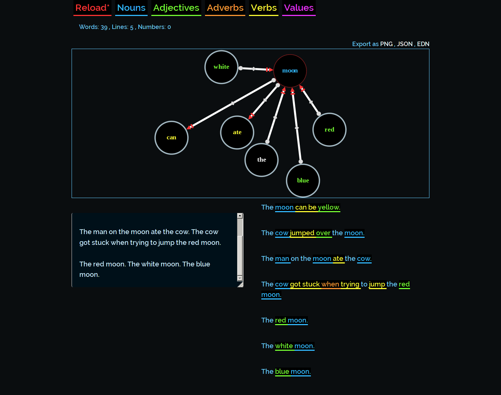

# WordyBirdy

Client-side Visual English Language Analysis.

## Watch and Use



### Selecting and deselecting nodes.
------------------------------------

#### With The Graph

Watch: [Node Selection Graph video](https://github.com/runexec/WordyBirdy/raw/master/readme/node-select.ogv)

All unrelated nodes are hidden until the node of focus is deselected. You can deselect a node by clicking another node or clicking off to the side. 

#### With The Sentence 

Watch: [Node Selection Sentence Text video](https://github.com/runexec/WordyBirdy/raw/master/readme/node-text-select.ogv)

Click any word within any sentence, and all nodes related to the word will be displayed.

#### With Word Type

Watch: [Node Selection Word Type  video](https://github.com/runexec/WordyBirdy/raw/master/readme/node-word-type.ogv)

You can hide or display nodes depending on the type of words you wish to display.

## Download and Run

All available versions can be downloaded at =>

https://github.com/runexec/WordbyBirdy

Using Git =>

`git clone https://github.com/runexec/WordbyBirdy`

Running the program 

`lein do cljsbuild once, run -m wordybirdy.server/run`

Older versions are still available at =>

https://github.com/runexec/WordbyBirdy

## Development

Open a terminal and type `lein repl` to start a Clojure REPL
(interactive prompt).

In the REPL, type

```clojure
(run)
(browser-repl)
```

The call to `(run)` does two things, it starts the webserver at port
10555, and also the Figwheel server which takes care of live reloading
ClojureScript code and CSS. Give them some time to start.

Running `(browser-repl)` starts the Weasel REPL server, and drops you
into a ClojureScript REPL. Evaluating expressions here will only work
once you've loaded the page, so the browser can connect to Weasel.

When you see the line `Successfully compiled "resources/public/app.js"
in 21.36 seconds.`, you're ready to go. Browse to
`http://localhost:10555` and enjoy.

**Attention: It is not longer needed to run `lein figwheel`
separately. This is now taken care of behind the scenes**

## Deploying to Heroku

This assumes you have a
[Heroku account](https://signup.heroku.com/dc), have installed the
[Heroku toolbelt](https://toolbelt.heroku.com/), and have done a
`heroku login` before.

``` sh
git init
git add -A
git commit
heroku create
git push heroku master:master
heroku open
```

## Running with Foreman

Heroku uses [Foreman](http://ddollar.github.io/foreman/) to run your
app, which uses the `Procfile` in your repository to figure out which
server command to run. Heroku also compiles and runs your code with a
Leiningen "production" profile, instead of "dev". To locally simulate
what Heroku does you can do:

``` sh
lein with-profile -dev,+production uberjar && foreman start
```

Now your app is running at
[http://localhost:5000](http://localhost:5000) in production mode.

## License

Copyright © 2014 Ryan Kelker

Distributed under the Eclipse Public License either version 1.0 or (at
your option) any later version.

## Chestnut

Created with [Chestnut](http://plexus.github.io/chestnut/) 0.7.0.
